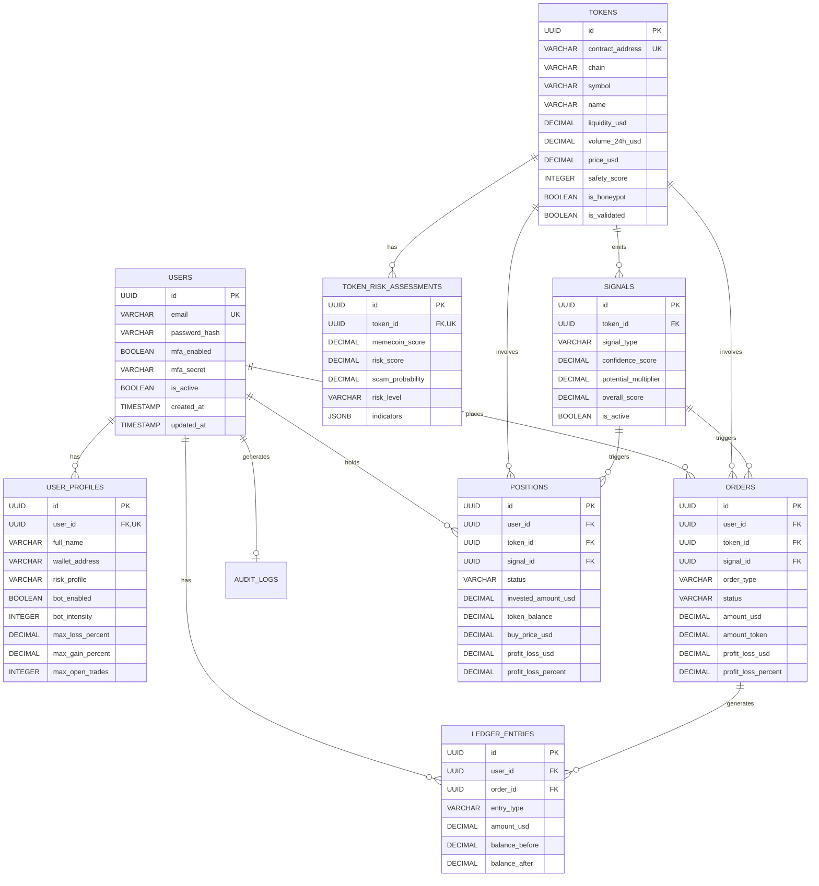

# 🗄️ Guia Completo do Banco de Dados - TradingBot

> **Referência detalhada de schema, relacionamentos, queries úteis e manutenção**  
> **Database**: PostgreSQL 15+  
> **Data**: Dezembro 2025

---

## 📊 Diagrama ER (Entity-Relationship)



---

## 📋 Tabelas Detalhadas

### 1. `users` - Autenticação

#### **Propósito**
Armazena credenciais e informações de autenticação dos usuários.

#### **Campos**

| Campo | Tipo | Constraints | Descrição |
|-------|------|-------------|-----------|
| `id` | UUID | PRIMARY KEY | Identificador único |
| `email` | VARCHAR(255) | UNIQUE, NOT NULL | E-mail (login) |
| `password_hash` | VARCHAR(255) | NOT NULL | Hash bcrypt da senha |
| `mfa_enabled` | BOOLEAN | DEFAULT false | MFA ativado? |
| `mfa_secret` | VARCHAR(255) | | Secret TOTP (se MFA ativo) |
| `is_active` | BOOLEAN | DEFAULT true | Usuário ativo? |
| `created_at` | TIMESTAMP | DEFAULT NOW() | Data de criação |
| `updated_at` | TIMESTAMP | DEFAULT NOW() | Última atualização |

#### **Índices**
- `idx_users_email` ON (`email`)
- `idx_users_active` ON (`is_active`)

#### **Queries Úteis**

```sql
-- Buscar usuário por e-mail (login)
SELECT id, email, password_hash, is_active 
FROM users 
WHERE email = $1 AND is_active = true;

-- Contar usuários ativos
SELECT COUNT(*) FROM users WHERE is_active = true;

-- Desativar usuário (soft delete)
UPDATE users SET is_active = false WHERE id = $1;
```

---

### 2. `user_profiles` - Perfil e Configurações

#### **Propósito**
Configurações de risco, preferências e informações adicionais do usuário.

#### **Campos**

| Campo | Tipo | Constraints | Descrição |
|-------|------|-------------|-----------|
| `id` | UUID | PRIMARY KEY | Identificador único |
| `user_id` | UUID | UNIQUE, FK → users.id | Referência ao usuário |
| `full_name` | VARCHAR(255) | | Nome completo |
| `phone` | VARCHAR(50) | | Telefone |
| `wallet_address` | VARCHAR(255) | | Endereço da carteira |
| `risk_profile` | VARCHAR(20) | CHECK | `conservative`, `moderate`, `aggressive` |
| `bot_enabled` | BOOLEAN | DEFAULT false | Bot ativo? |
| `bot_intensity` | INTEGER | 1-10 | Intensidade do bot (10 = máximo) |
| `max_loss_percent` | DECIMAL(5,2) | DEFAULT 10.00 | % máximo de perda por trade |
| `max_gain_percent` | DECIMAL(5,2) | DEFAULT 25.00 | % máximo de ganho antes de vender |
| `max_open_trades` | INTEGER | DEFAULT 3 | Máx. posições abertas simultâneas |

#### **Queries Úteis**

```sql
-- Buscar perfil completo do usuário
SELECT u.email, p.*
FROM users u
JOIN user_profiles p ON u.id = p.user_id
WHERE u.id = $1;

-- Atualizar configurações de risco
UPDATE user_profiles 
SET risk_profile = 'aggressive',
    max_loss_percent = 8,
    max_gain_percent = 30,
    max_open_trades = 5
WHERE user_id = $1;

-- Listar usuários com bot ativo
SELECT u.email, p.risk_profile, p.bot_intensity
FROM users u
JOIN user_profiles p ON u.id = p.user_id
WHERE p.bot_enabled = true;
```

---

### 3. `tokens` - Tokens Validados

#### **Propósito**
Todos os tokens validados com seus dados de mercado.

#### **Campos Principais**

| Campo | Tipo | Descrição |
|-------|------|-----------|
| `id` | UUID | PK |
| `contract_address` | VARCHAR(255) | Endereço único do contrato |
| `chain` | VARCHAR(50) | BSC, ETH, ARBITRUM, POLYGON, SOLANA |
| `symbol` | VARCHAR(50) | Ex: DOGE, PEPE |
| `name` | VARCHAR(255) | Nome completo |
| `liquidity_usd` | DECIMAL(20,2) | Liquidez em USD |
| `volume_24h_usd` | DECIMAL(20,2) | Volume 24h |
| `price_usd` | DECIMAL(20,10) | Preço atual |
| `safety_score` | INTEGER | 0-100 (score de segurança) |
| `is_honeypot` | BOOLEAN | É honeypot? |
| `is_validated` | BOOLEAN | Foi validado? |
| `validated_at` | TIMESTAMP | Quando foi validado |

#### **Queries Úteis**

```sql
-- Listar tokens validados (não-honeypot)
SELECT contract_address, symbol, name, price_usd, safety_score
FROM tokens
WHERE is_validated = true 
  AND is_honeypot = false
  AND safety_score \u003e= 50
ORDER BY validated_at DESC
LIMIT 50;

-- Buscar token por endereço
SELECT * FROM tokens WHERE contract_address = LOWER($1);

-- Tokens com maior volume
SELECT symbol, name, volume_24h_usd, price_usd
FROM tokens
WHERE is_validated = true
ORDER BY volume_24h_usd DESC NULLS LAST
LIMIT 20;

-- Atualizar preço de um token
UPDATE tokens 
SET price_usd = $1, updated_at = CURRENT_TIMESTAMP 
WHERE id = $2;
```

---

### 4. `token_risk_assessments` - Avaliação de Risco

#### **Propósito**
Scoring multi-dimensional de risco para cada token.

#### **Campos**

| Campo | Tipo | Descrição |
|-------|------|-----------|
| `id` | UUID | PK |
| `token_id` | UUID | FK → tokens.id (UNIQUE) |
| `contract_address` | VARCHAR(255) | Duplicação para performance |
| `chain` | VARCHAR(50) | Duplicação para performance |
| `memecoin_score` | DECIMAL(5,2) | 0-100 (aderência a perfil memecoin) |
| `risk_score` | DECIMAL(5,2) | 0-100 (maior = mais seguro) |
| `scam_probability` | DECIMAL(5,2) | 0-100 (probabilidade de rugpull) |
| `risk_level` | VARCHAR(32) | critical, high, moderate, low |
| `indicators` | JSONB | Detalhes dos indicadores |

#### **Estrutura do JSONB `indicators`**

```json
{
  "honeypot": false,
  "liquidity_locked": true,
  "holders_count": 1234,
  "top10_concentration": 45.2,
  "contract_age_days": 12,
  "volume_volatility": 3.5,
  "liquidity_depth": "high",
  "warning_flags": []
}
```

#### **Queries Úteis**

```sql
-- Tokens com baixo risco
SELECT t.symbol, t.name, ra.risk_score, ra.scam_probability, ra.risk_level
FROM tokens t
JOIN token_risk_assessments ra ON ra.token_id = t.id
WHERE ra.risk_level IN ('low', 'moderate')
  AND ra.scam_probability \u003c 30
ORDER BY ra.risk_score DESC
LIMIT 20;

-- Detalhes de risco de um token
SELECT 
  t.symbol,
  ra.memecoin_score,
  ra.risk_score,
  ra.scam_probability,
  ra.risk_level,
  ra.indicators
FROM tokens t
JOIN token_risk_assessments ra ON ra.token_id = t.id
WHERE t.contract_address = LOWER($1);

-- Tokens com alto risco de scam
SELECT t.symbol, t.name, ra.scam_probability, ra.indicators
FROM tokens t
JOIN token_risk_assessments ra ON ra.token_id = t.id
WHERE ra.scam_probability \u003e 70
ORDER BY ra.scam_probability DESC;
```

---

### 5. `signals` - Sinais BUY/SELL/HOLD

#### **Propósito**
Sinais gerados pela IA baseada em regras.

#### **Campos Principais**

| Campo | Tipo | Descrição |
|-------|------|-----------|
| `id` | UUID | PK |
| `token_id` | UUID | FK → tokens.id |
| `signal_type` | VARCHAR(10) | BUY, SELL, HOLD |
| `confidence_score` | DECIMAL(5,2) | 30-95% |
| `potential_multiplier` | DECIMAL(4,2) | 0.4x - 5.0x |
| `overall_score` | DECIMAL(5,2) | Score geral (0-100) |
| `reasoning` | TEXT | Razão do sinal |
| `is_active` | BOOLEAN | Sinal ativo? |
| `expires_at` | TIMESTAMP | Expiração (se aplicável) |

#### **Queries Úteis**

```sql
-- Sinais BUY ativos
SELECT 
  s.*, 
  t.symbol, 
  t.name, 
  t.price_usd, 
  t.volume_24h_usd
FROM signals s
JOIN tokens t ON s.token_id = t.id
WHERE s.is_active = true 
  AND s.signal_type = 'BUY'
  AND (s.expires_at IS NULL OR s.expires_at \u003e NOW())
ORDER BY s.confidence_score DESC, s.created_at DESC
LIMIT 20;

-- Histórico de sinais de um token
SELECT signal_type, confidence_score, overall_score, reasoning, created_at
FROM signals
WHERE token_id = $1
ORDER BY created_at DESC
LIMIT 10;

-- Taxa de acerto de sinais (requer join com orders)
SELECT 
  s.signal_type,
  COUNT(*) as total_signals,
  SUM(CASE WHEN o.profit_loss_usd \u003e 0 THEN 1 ELSE 0 END) as wins,
  SUM(CASE WHEN o.profit_loss_usd \u003c 0 THEN 1 ELSE 0 END) as losses
FROM signals s
LEFT JOIN orders o ON o.signal_id = s.id AND o.status = 'completed'
WHERE s.signal_type = 'BUY'
GROUP BY s.signal_type;
```

---

### 6. `orders` - Ordens de Compra/Venda

#### **Propósito**
Registro de todas as ordens executadas (BUY e SELL).

#### **Campos**

| Campo | Tipo | Descrição |
|-------|------|-----------|
| `id` | UUID | PK |
| `user_id` | UUID | FK → users.id |
| `token_id` | UUID | FK → tokens.id |
| `signal_id` | UUID | FK → signals.id (opcional) |
| `order_type` | VARCHAR(10) | BUY ou SELL |
| `status` | VARCHAR(20)  | pending, completed, failed, cancelled |
| `amount_usd` | DECIMAL(20,2) | Valor em USD |
| `amount_token` | DECIMAL(40,18) | Quantidade de tokens |
| `price_usd` | DECIMAL(20,10) | Preço no momento da execução |
| `profit_loss_usd` | DECIMAL(20,2) | Lucro/Perda (apenas SELL) |
| `profit_loss_percent` | DECIMAL(8,2) | Lucro/Perda % (apenas SELL) |
| `hold_time_hours` | DECIMAL(10,2) | Tempo de hold (apenas SELL) |
| `transaction_hash` | VARCHAR(255) | Hash da transação on-chain |
| `executed_at` | TIMESTAMP | Quando foi executada |

#### **Queries Úteis**

```sql
-- Ordens do usuário (histórico)
SELECT 
  o.order_type,
  t.symbol,
  o.amount_usd,
  o.price_usd,
  o.profit_loss_usd,
  o.profit_loss_percent,
  o.status,
  o.executed_at
FROM orders o
JOIN tokens t ON o.token_id = t.id
WHERE o.user_id = $1
ORDER BY o.executed_at DESC
LIMIT 50;

-- Performance do usuário
SELECT 
  user_id,
  COUNT(*) as total_trades,
  SUM(CASE WHEN order_type = 'SELL' AND profit_loss_usd \u003e 0 THEN 1 ELSE 0 END) as wins,
  SUM(CASE WHEN order_type = 'SELL' AND profit_loss_usd \u003c 0 THEN 1 ELSE 0 END) as losses,
  ROUND(
    100.0 * SUM(CASE WHEN order_type = 'SELL' AND profit_loss_usd \u003e 0 THEN 1 ELSE 0 END) / 
    NULLIF(COUNT(CASE WHEN order_type = 'SELL' THEN 1 END), 0),
    2
  ) as win_rate,
  SUM(CASE WHEN order_type = 'SELL' THEN profit_loss_usd ELSE 0 END) as total_pnl
FROM orders
WHERE user_id = $1 AND status = 'completed'
GROUP BY user_id;

-- Melhores trades (maiores lucros)
SELECT 
  t.symbol,
  o.amount_usd as invested,
  o.profit_loss_usd,
  o.profit_loss_percent,
  o.hold_time_hours,
  o.executed_at
FROM orders o
JOIN tokens t ON o.token_id = t.id
WHERE o.user_id = $1 
  AND o.order_type = 'SELL' 
  AND o.status = 'completed'
ORDER BY o.profit_loss_usd DESC
LIMIT 10;
```

---

### 7. `positions` - Posições Abertas/Fechadas

#### **Propósito**
Tracking de posições (tokens mantidos em carteira).

#### **Campos**

| Campo | Tipo | Descrição |
|-------|------|-----------|
| `id` | UUID | PK |
| `user_id` | UUID | FK → users.id |
| `token_id` | UUID | FK → tokens.id |
| `order_id` | UUID | FK → orders.id (ordem BUY inicial) |
| `signal_id` | UUID | FK → signals.id (sinal que gerou) |
| `status` | VARCHAR(20) | open, closed |
| `invested_amount_usd` | DECIMAL(20,2) | Total investido |
| `token_balance` | DECIMAL(40,18) | Qtd de tokens mantidos |
| `buy_price_usd` | DECIMAL(20,10) | Preço médio de compra |
| `current_price_usd` | DECIMAL(20,10) | Preço atual |
| `profit_loss_usd` | DECIMAL(20,2) | Lucro/Perda realizado (closed) |
| `profit_loss_percent` | DECIMAL(8,2) | Lucro/Perda % (closed) |
| `buy_time` | TIMESTAMP | Quando comprou |
| `closed_at` | TIMESTAMP | Quando fechou |

#### **Queries Úteis**

```sql
-- Posições abertas do usuário
SELECT 
  p.id,
  t.symbol,
  t.name,
  p.invested_amount_usd,
  p.token_balance,
  p.buy_price_usd,
  t.price_usd as current_price,
  (t.price_usd - p.buy_price_usd) / p.buy_price_usd * 100 as unrealized_pnl_percent,
  (p.token_balance * t.price_usd) - p.invested_amount_usd as unrealized_pnl_usd,
  EXTRACT(EPOCH FROM (NOW() - p.buy_time)) / 3600 as hold_time_hours
FROM positions p
JOIN tokens t ON p.token_id = t.id
WHERE p.user_id = $1 AND p.status = 'open'
ORDER BY p.buy_time ASC;

-- Total investido em posições abertas
SELECT SUM(invested_amount_usd) as total_invested
FROM positions
WHERE user_id = $1 AND status = 'open';

-- Histórico de posições fechadas
SELECT 
  t.symbol,
  p.invested_amount_usd,
  p.profit_loss_usd,
  p.profit_loss_percent,
  p.hold_time_hours,
  p.closed_at
FROM positions p
JOIN tokens t ON p.token_id = t.id
WHERE p.user_id = $1 AND p.status = 'closed'
ORDER BY p.closed_at DESC
LIMIT 20;
```

---

### 8. `ledger_entries` - Registro Contábil

#### **Propósito**
Histórico completo de movimentações financeiras.

#### **Tipos de Entry**

| entry_type | Descrição |
|------------|-----------|
| `deposit` | Depósito de capital |
| `withdrawal` | Saque de capital |
| `trade_profit` | Lucro de venda |
| `trade_loss` | Perda de venda |
| `fee` | Taxa de transação |
| `gas` | Gas fee pago |

#### **Queries Úteis**

```sql
-- Calcular saldo do usuário
SELECT 
  COALESCE(SUM(CASE WHEN entry_type IN ('deposit', 'trade_profit') THEN amount_usd ELSE 0 END), 0) AS credits,
  COALESCE(SUM(CASE WHEN entry_type IN ('withdrawal', 'trade_loss', 'fee', 'gas') THEN ABS(amount_usd) ELSE 0 END), 0) AS debits,
  COALESCE(SUM(CASE WHEN entry_type IN ('deposit', 'trade_profit') THEN amount_usd ELSE 0 END), 0) -
  COALESCE(SUM(CASE WHEN entry_type IN ('withdrawal', 'trade_loss', 'fee', 'gas') THEN ABS(amount_usd) ELSE 0 END), 0) AS balance
FROM ledger_entries
WHERE user_id = $1;

-- Histórico de movimentações
SELECT 
  entry_type,
  amount_usd,
  balance_before,
  balance_after,
  description,
  created_at
FROM ledger_entries
WHERE user_id = $1
ORDER BY created_at DESC
LIMIT 50;

-- Total depositado vs total retirado
SELECT 
  SUM(CASE WHEN entry_type = 'deposit' THEN amount_usd ELSE 0 END) as total_deposits,
  SUM(CASE WHEN entry_type = 'withdrawal' THEN amount_usd ELSE 0 END) as total_withdrawals
FROM ledger_entries
WHERE user_id = $1;
```

---

## 🔧 Manutenção do Banco de Dados

### Backup Automático

```bash
# Backup diário (adicionar ao cron)
#!/bin/bash
DATE=$(date +\%Y\%m\%d_\%H\%M\%S)
pg_dump -U botuser -d tradingbot -F c -f /backups/tradingbot_$DATE.dump

# Manter apenas últimos 7 dias
find /backups -name "tradingbot_*.dump" -mtime +7 -delete
```

### Limpeza de Dados Antigos

```sql
-- Deletar sinais inativos com mais de 30 dias
DELETE FROM signals 
WHERE is_active = false 
  AND created_at \u003c NOW() - INTERVAL '30 days';

-- Deletar audit_logs com mais de 90 dias
DELETE FROM audit_logs 
WHERE created_at \u003c NOW() - INTERVAL '90 days';

-- Limpar tokens não-validados com mais de 7 dias
DELETE FROM tokens 
WHERE is_validated = false 
  AND created_at \u003c NOW() - INTERVAL '7 days';
```

### Reindexação (Performance)

```sql
-- Recriar índices (após muitas inserções/updates)
REINDEX TABLE tokens;
REINDEX TABLE orders;
REINDEX TABLE signals;
REINDEX TABLE positions;

-- Analisar estatísticas das tabelas
ANALYZE tokens;
ANALYZE orders;
ANALYZE signals;
ANALYZE positions;

-- Vacuum completo (recuperar espaço)
VACUUM FULL ANALYZE;
```

---

## 📈 Queries Analíticas

### Dashboard de Performance

```sql
-- Métricas gerais do sistema
SELECT 
  (SELECT COUNT(*) FROM users WHERE is_active = true) as total_users,
  (SELECT COUNT(*) FROM tokens WHERE is_validated = true) as total_tokens,
  (SELECT COUNT(*) FROM positions WHERE status = 'open') as open_positions,
  (SELECT COUNT(*) FROM orders WHERE status = 'completed' AND created_at \u003e NOW() - INTERVAL '24 hours') as trades_24h,
  (SELECT SUM(amount_usd) FROM orders WHERE order_type = 'BUY' AND status = 'completed' AND created_at \u003e NOW() - INTERVAL '24 hours') as volume_24h;
```

### Top Performers

```sql
-- Top 10 usuários por lucro
SELECT 
  u.email,
  SUM(o.profit_loss_usd) as total_profit,
  COUNT(CASE WHEN o.order_type = 'SELL' THEN 1 END) as total_trades,
  ROUND(
    100.0 * SUM(CASE WHEN o.profit_loss_usd \u003e 0 THEN 1 ELSE 0 END) / 
    NULLIF(COUNT(CASE WHEN o.order_type = 'SELL' THEN 1 END), 0),
    2
  ) as win_rate
FROM users u
JOIN orders o ON o.user_id = u.id
WHERE o.status = 'completed' AND o.order_type = 'SELL'
GROUP BY u.id, u.email
ORDER BY total_profit DESC
LIMIT 10;
```

### Tokens Mais Tradados

```sql
-- Top 20 tokens por volume de trades
SELECT 
  t.symbol,
  t.name,
  COUNT(*) as total_orders,
  SUM(o.amount_usd) as total_volume_usd,
  AVG(o.profit_loss_percent) FILTER (WHERE o.order_type = 'SELL') as avg_pnl_percent
FROM tokens t
JOIN orders o ON o.token_id = t.id
WHERE o.status = 'completed'
GROUP BY t.id, t.symbol, t.name
ORDER BY total_volume_usd DESC
LIMIT 20;
```

---

**FIM DO GUIA DE BANCO DE DADOS**
