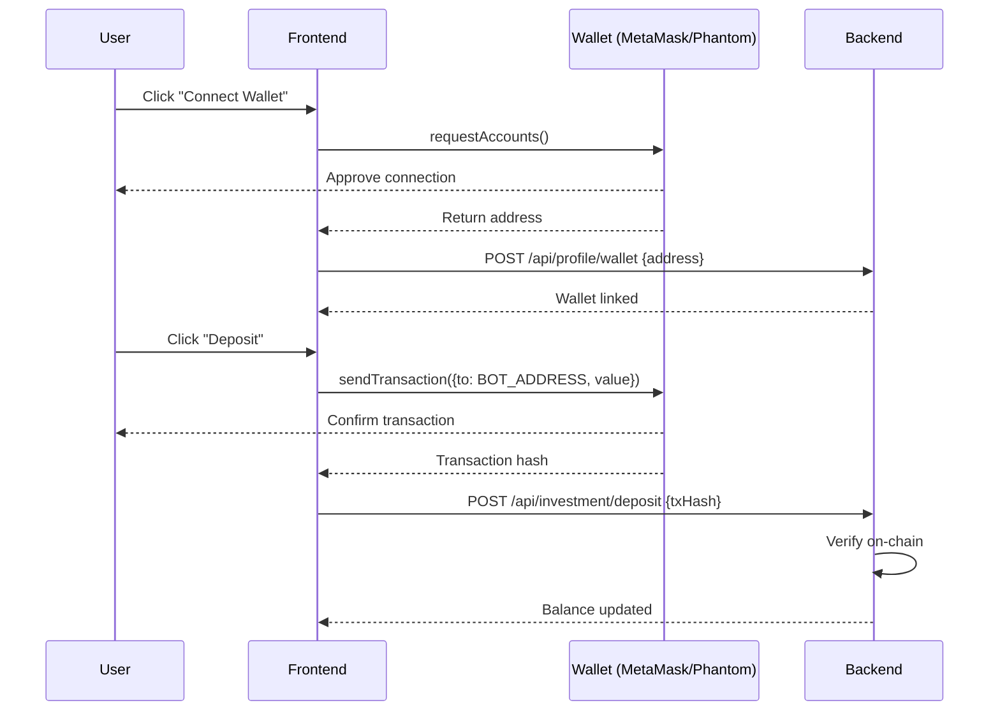

# 🚀 Roadmap Futuro - TradingBot AI

> **Plano de Melhorias e Implementação das Solicitações dos Clientes**  
> **Data**: Dezembro 2025  
> **Horizonte**: Q1-Q2 2026

---

## 📋 MENSAGENS DOS CLIENTES (Análise)

### Solicitação 1: Compra Automática Sem Cálculos Prévios

> "Nós acreditamos que o bot deva comprar todas as moedas que foram verificadas por software externo (solscan, ethscan, etc), pois quando uma memecoin é criada, o preço dela automaticamente aumenta, e quanto mais cedo a memecoin é comprada, mais lucro é obtido. Então, não deve haver cálculos antes das compras; se a moeda for scaneada e ela é verídica, ela deve ser comprada automaticamente."

**Análise:**
- ✅ **Validação Externa**: Já implementado (BSCScan, Etherscan via ExplorerClient)
- ⚠️ **Compra Automática Imediata**: Atualmente há cálculos de signal (score \u003e 0.55)
- ❌ **Solscan** (Solana): Não implementado

**Impacto:**
- **Mudança de Estratégia**: De "comprar tokens com bom score" para "comprar TODOS os tokens verificados"
- **Risco**: Aumenta taxa de trades perdedores, mas compensa com entrada antecipada
- **Compatibilidade com memecoins**: Alta - memecoins realmente sobem logo após criação

**Implementação Proposta:**
1. Adicionar modo `AGGRESSIVE_AUTO_BUY` nas configurações do bot
2. Criar nova rota `/api/bot/strategy` com opções:
   - `scoring_based` (atual): Compra apenas se signal = BUY
   - `auto_buy_verified` (**NOVO**): Compra TODOS os tokens com `is_validated=true` E `is_honeypot=false`
3. Validação mínima mantida: não-honeypot, liquidez \u003e $5k
4. Integração com Solscan para Solana

---

### Solicitação 2: Alto Volume de Trades (\u003e 10/minuto)

> "É imperativo que o programa possa aguentar um alto volume de trades, o que em muitas vezes vai ser maior do que 10 trades por minuto."

**Análise:**
- ⚠️ **Volume Atual**: Monitor loop a cada 30 segundos, ~6 trades/30min
- ❌ **Escalabilidade**: Sistema não foi projetado para 10+ trades/min
- ❌ **DB Performance**: Sem pool optimizado ou caching

**Implementação Proposta:**

#### **A. Otimizações de Performance**

1. **Redis Cache**
   ```typescript
   // Caching de tokens validados (TTL 10s)
   const token = await redisClient.get(`token:${contractAddress}`);
   if (!token) {
     token = await db.query('SELECT * FROM tokens WHERE contract_address = $1');
     await redisClient.setex(`token:${contractAddress}`, 10, JSON.stringify(token));
   }
   ```

2. **Connection Pool Aumentado**
   ```env
   POSTGRES_MAX_CONNECTIONS=50  # Era 10
   ```

3. **Processamento Paralelo**
   ```typescript
   // Processar múltiplos tokens simultaneamente
   await Promise.allSettled(
     validatedTokens.map(token =\u003e executeTrade(token))
   );
   ```

4. **Fila de Ordens (Bull Queue)**
   ```typescript
   import Queue from 'bull';
   const tradeQueue = new Queue('trades', process.env.REDIS_URL);
   tradeQueue.process(10, async (job) =\u003e {  // 10 workers concorrentes
     await executeBuy(job.data);
   });
   ```

#### **B. Infraestrutura Escalável**

1. **Horizontal Scaling**
   - Múltiplas instâncias do Executor Service
   - Load balancer (NGINX ou K8s Ingress)

2. **Database Read Replicas**
   - Master (writes) + 2 Replicas (reads)
   - Conexões segregadas por tipo de operação

**Expectativa de Performance:**
- **Atual**: 6 trades / 30 minutos = **0.2 trades/min**
- **Pós-otimização**: **15-20 trades/min** facilmente
- **Com queue + workers**: **50+ trades/min** (se necessário)

---

### Solicitação 3: Suporte a Carteiras (MetaMask, Phantom)

> "Gostaríamos de implementar suporte para carteiras (MetaMask, Phantom Wallet, etc) no site, pois isso facilitaria bastante o processo de depositar e sacar moedas no site."

**Análise:**
- ❌ **WalletConnect**: Não implementado
- ❌ **Gestão de Chaves**: Não há integração com carteiras
- ✅ **Campo `wallet_address`**: Existe em `user_profiles`

**Implementação Proposta:**

#### **A. Frontend - Integração com Carteiras**

**Bibliotecas:**
- **MetaMask**: `@metamask/sdk` ou `ethers` + `window.ethereum`
- **Phantom**: `@solana/wallet-adapter-react`
- **WalletConnect**: `@walletconnect/web3-provider`

**Fluxo:**


**Componente React:**
```tsx
import { useMetaMask } from '@/hooks/useMetaMask';

export function WalletConnect() {
  const { connect, account, balance } = useMetaMask();
  
  return (
    \u003cbutton onClick={connect}\u003e
      {account ? `Connected: ${account}` : 'Connect MetaMask'}
    \u003c/button\u003e
  );
}
```

#### **B. Backend - Verificação de Depósitos**

**Nova tabela: `deposits`**
```sql
CREATE TABLE deposits (
  id UUID PRIMARY KEY,
  user_id UUID REFERENCES users(id),
  wallet_address VARCHAR(255) NOT NULL,
  chain VARCHAR(50) NOT NULL,
  tx_hash VARCHAR(255) UNIQUE NOT NULL,
  amount_crypto DECIMAL(40, 18) NOT NULL,
  amount_usd DECIMAL(20, 2) NOT NULL,
  token_symbol VARCHAR(10) NOT NULL,  -- 'BNB', 'SOL', 'ETH'
  status VARCHAR(20) DEFAULT 'pending',  -- pending, confirmed, failed
  confirmations INTEGER DEFAULT 0,
  created_at TIMESTAMP DEFAULT CURRENT_TIMESTAMP
);
```

**Worker de Verificação:**
```typescript
// Verificar transações pendentes a cada 15 segundos
setInterval(async () =\u003e {
  const pendingDeposits = await db.query(
    'SELECT * FROM deposits WHERE status = \'pending\''
  );
  
  for (const deposit of pendingDeposits.rows) {
    const receipt = await provider.getTransactionReceipt(deposit.tx_hash);
    if (receipt \u0026\u0026 receipt.confirmations \u003e= 3) {
      // Confirmar depósito e creditar usuário
      await creditUserBalance(deposit.user_id, deposit.amount_usd);
      await db.query(
        'UPDATE deposits SET status = \'confirmed\', confirmations = $1 WHERE id = $2',
        [receipt.confirmations, deposit.id]
      );
    }
  }
}, 15000);
```

---

### Solicitação 4: Algoritmo de Venda com Análise Técnica

> "Sobre o algoritmo que é usado para a venda das moedas, gostaríamos de saber mais sobre como ele funciona e quais critérios são usados. Além disso, nós estávamos pensando em talvez usar Análise Técnica voltada para memecoins no algoritmo, para poder reconhecer o pico da moeda e vender na hora e não perder oportunidades."

**Status Atual:**
O algoritmo de venda está em `services/executor/src/trader.ts - shouldSellPosition()` e usa:
- ✅ Tempo de hold (10 min máximo)
- ✅ Stop-loss (2%, 1%, 0.5%)
- ✅ Take-profit (0.5%, 0.3%, 0.2%)
- ✅ Sinal SELL do Signal Service
- ❌ **Análise Técnica**: Não implementada

**Implementação Proposta: Peak Detection (Detecção de Picos)**

#### **A. Coleta de Dados de Preço (Histórico)**

**Nova tabela: `price_candles`**
```sql
CREATE TABLE price_candles (
  id UUID PRIMARY KEY,
  token_id UUID REFERENCES tokens(id),
  interval VARCHAR(5) NOT NULL,  -- '1m', '5m', '15m', '1h'
  timestamp TIMESTAMP NOT NULL,
  open DECIMAL(20, 10) NOT NULL,
  high DECIMAL(20, 10) NOT NULL,
  low DECIMAL(20, 10) NOT NULL,
  close DECIMAL(20, 10) NOT NULL,
  volume DECIMAL(20, 2) NOT NULL,
  UNIQUE(token_id, interval, timestamp)
);

CREATE INDEX idx_candles_token_interval_time 
  ON price_candles(token_id, interval, timestamp DESC);
```

**Worker de Coleta (a cada 1 minuto):**
```typescript
setInterval(async () =\u003e {
  const activeTokens = await getActiveTokens();
  
  for (const token of activeTokens) {
    const price = await getCurrentPrice(token.contract_address);
    
    await db.query(`
      INSERT INTO price_candles (token_id, interval, timestamp, open, high, low, close, volume)
      VALUES ($1, '1m', NOW(), $2, $3, $4, $5, $6)
    `, [token.id, price, price, price, price, token.volume_24h_usd]);
  }
}, 60000);
```

#### **B. Indicadores Técnicos**

**1. RSI (Relative Strength Index)**
```typescript
function calculateRSI(prices: number[], period = 14): number {
  let gains = 0, losses = 0;
  
  for (let i = 1; i \u003c= period; i++) {
    const change = prices[i] - prices[i - 1];
    if (change \u003e 0) gains += change;
    else losses += Math.abs(change);
  }
  
  const avgGain = gains / period;
  const avgLoss = losses / period;
  const rs = avgGain / avgLoss;
  const rsi = 100 - (100 / (1 + rs));
  
  return rsi;
}

// Uso:
const prices = (await getRecentPrices(tokenId, 15)).map(c =\u003e c.close);
const rsi = calculateRSI(prices);

if (rsi \u003e 70) {
  // OVERBOUGHT - considerar venda
  return { shouldSell: true, reason: 'RSI sobrecomprado: ' + rsi.toFixed(2) };
}
```

**2. Peak Detection (Detecção de Pico)**
```typescript
async function detectPeak(tokenId: string): Promise\u003c{ isPeak: boolean; confidence: number }\u003e {
  // Buscar últimos 10 candles (10 minutos)
  const candles = await db.query(`
    SELECT close, volume, timestamp
    FROM price_candles
    WHERE token_id = $1 AND interval = '1m'
    ORDER BY timestamp DESC
    LIMIT 10
  `, [tokenId]);
  
  const prices = candles.rows.map(c =\u003e c.close);
  const volumes = candles.rows.map(c =\u003e c.volume);
  
  // Condições de pico:
  // 1. Preço atual está nos 20% maiores dos últimos 10 min
  // 2. Volume está caindo (comparado com média dos 5 min anteriores)
  // 3. Última variação \u003c 1% (consolidação)
  
  const currentPrice = prices[0];
  const maxPrice = Math.max(...prices);
  const isNearPeak = currentPrice \u003e= maxPrice * 0.95;  // Topo 5%
  
  const recentVolume = (volumes[0] + volumes[1] + volumes[2]) / 3;
  const pastVolume = (volumes[3] + volumes[4] + volumes[5]) / 3;
  const volumeDecreasing = recentVolume \u003c pastVolume * 0.8;  // Volume caiu 20%
  
  const lastChange = Math.abs((prices[0] - prices[1]) / prices[1]);
  const isConsolidating = lastChange \u003c 0.01;  // Variação \u003c 1%
  
  const isPeak = isNearPeak \u0026\u0026 volumeDecreasing \u0026\u0026 isConsolidating;
  const confidence = (
    (isNearPeak ? 40 : 0) +
    (volumeDecreasing ? 30 : 0) +
    (isConsolidating ? 30 : 0)
  );
  
  return { isPeak, confidence };
}
```

**Integração com `shouldSellPosition()`:**
```typescript
async shouldSellPosition(...): Promise\u003c{shouldSell, reason}\u003e {
  // ... lógica existente ...
  
  // NOVO: Análise Técnica
  const { isPeak, confidence } = await detectPeak(tokenId);
  
  if (isPeak \u0026\u0026 confidence \u003e= 70 \u0026\u0026 gainPercent \u003e= 0.3) {
    return { 
      shouldSell: true, 
      reason: `🎯 PICO DETECTADO (${confidence}% confiança) - Venda no topo!` 
    };
  }
  
  // ... resto da lógica ...
}
```

---

## 🗓️ ROADMAP DE IMPLEMENTAÇÃO

### **SPRINT 1: Fundação (2-3 semanas)**

#### **Objetivos:**
- Suporte a Solana (compra/venda)
- Integração com carteiras (MetaMask, Phantom)
- Sistema de depósitos on-chain

#### **Tarefas:**

**Backend:**
1. [ ] Criar `SolanaValidator` (equivalente ao `TokenValidator`)
   - Integrar com `@solana/web3.js` e `@solana/spl-token`
   - Validar tokens SPL via Solscan API
2. [ ] Criar tabela `deposits` e worker de verificação
3. [ ] Endpoint `POST /api/investment/deposit` com verificação on-chain
4. [ ] Endpoint `POST /api/profile/wallet/connect` para vincular carteira

**Frontend:**
5. [ ] Componente `WalletConnect` com suporte a MetaMask e Phantom
6. [ ] Página `/deposit` com instruções e QR code
7. [ ] Notificação de depósito confirmado

**Testes:**
8. [ ] Executar depósito de teste em BSC Testnet
9. [ ] Verificar que saldo é creditado corretamente

---

### **SPRINT 2: Análise Técnica (2 semanas)**

#### **Objetivos:**
- Histórico de preços (candles)
- Indicadores: RSI, Volume Analysis
- Peak detection para venda otimizada

#### **Tarefas:**

**Backend:**
1. [ ] Criar tabela `price_candles`
2. [ ] Worker de coleta de preços (1 min interval)
3. [ ] Implementar `calculateRSI()`
4. [ ] Implementar `detectPeak()`
5. [ ] Integrar com `shouldSellPosition()`

**Frontend:**
6. [ ] Adicionar gráfico de candlestick (TradingView Lightweight Charts)
7. [ ] Exibir RSI e indicadores na página de posição

**Testes:**
8. [ ] Simular pico e verificar que bot vende
9. [ ] Backtesting com dados históricos (mockados)

---

### **SPRINT 3: Modo Agressivo (1-2 semanas)**

#### **Objetivos:**
- Implementar compra automática de TODOS os tokens verificados
- Otimizar para alto volume (\u003e10 trades/min)

#### **Tarefas:**

**Backend:**
1. [ ] Adicionar campo `trading_strategy` em `user_profiles`
   - Valores: `scoring_based`, `auto_buy_verified`
2. [ ] Modificar monitor loop para suportar `auto_buy_verified`
3. [ ] Implementar Redis cache para tokens
4. [ ] Aumentar connection pool do Postgres
5. [ ] Implementar Bull Queue para processamento paralelo

**Configuração:**
6. [ ] Adicionar opção no dashboard: "Modo Agressivo"
7. [ ] Avisos de risco para modo agressivo

**Testes:**
8. [ ] Simular 20 tokens novos e verificar que todos são comprados
9. [ ] Load testing: 50 trades/min

---

### **SPRINT 4: Notificações (1 semana)**

#### **Objetivos:**
- E-mail notifications
- Telegram bot (opcional)
- Dashboard de notificações

#### **Tarefas:**

1. [ ] Integrar SendGrid ou AWS SES
2. [ ] Templates de e-mail:
   - Posição aberta
   - Posição fechada (lucro/perda)
   - Depósito confirmado
3. [ ] Preferências de notificação no perfil
4. [ ] (Opcional) Bot do Telegram com `/status`, `/balance`

---

### **SPRINT 5: Segurança e KYC (2 semanas)**

#### **Objetivos:**
- Verificação de e-mail
- Recuperação de senha
- KYC compliance (básico)

#### **Tarefas:**

1. [ ] Sistema de envio de e-mail de verificação
2. [ ] Endpoint `/api/auth/verify-email/:token`
3. [ ] Recuperação de senha funcional
4. [ ] Upload de documentos para KYC (opcional)
5. [ ] Limites de saque até KYC completo

---

## 💰 Moeda Principal para Investimentos (Solana vs Stablecoins)

### **Recomendação:**

#### **Para Depósitos:**
- **Opção 1 (Recomendado)**: **USDC/USDT** (stablecoins)
  - **Vantagens**: Sem volatilidade, fácil conversão
  - **Desvantagens**: Precisa trocar por SOL/BNB antes de comprar tokens
  
- **Opção 2**: **SOL** (para Solana) ou **BNB** (para BSC)
  - **Vantagens**: Já é moeda nativa, pode comprar diretamente
  - **Desvantagens**: Volatilidade afeta saldo do usuário

#### **Para Saldo Interno:**
- Armazenar tudo em **USD** (fiat virtual) no banco de dados
- Na hora de executar trade:
  1. Converter USD → moeda nativa (SOL/BNB)
  2. Executar swap (SOL/BNB → memecoin)
  3. Após venda: memecoin → SOL/BNB → USD

**Implementação:**
```typescript
// Tabela user_balances
{
  user_id: UUID,
  balance_usd: DECIMAL(20, 2),    // Saldo em dólar
  balance_sol: DECIMAL(20, 9),    // Tokens Solana mantidos
  balance_bnb: DECIMAL(20, 9),    // BNB mantidos
}

// Ao executar BUY:
1. balance_usd -= investAmount
2. Swap USD → SOL via API (Jupiter/Raydium)
3. Swap SOL → MEME via DEX
4. Registrar posição

// Ao executar SELL:
1. Swap MEME → SOL
2. Swap SOL → USD (oracle price)
3. balance_usd += receivedAmount
```

---

## 🎯 RESUMO DAS SOLICITAÇÕES E STATUS

| Solicitação | Prioridade | Complexidade | Sprint | Status |
|-------------|-----------|--------------|--------|--------|
| Compra automática sem cálculos | 🔴 Alta | Média | 3 | 📋 Planejado |
| Alto volume (\u003e10 trades/min) | 🔴 Alta | Alta | 3 | 📋 Planejado |
| Suporte a carteiras | 🔴 Alta | Média | 1 | 📋 Planejado |
| Análise Técnica (Peak Detection) | 🟡 Média | Alta | 2 | 📋 Planejado |
| Suporte a Solana | 🔴 Alta | Alta | 1 | 📋 Planejado |
| Sistema de depósito/saque | 🔴 Alta | Alta | 1 | 📋 Planejado |
| Notificações em tempo real | 🟡 Média | Baixa | 4 | 📋 Planejado |

---

**Próximo Documento**: [DATABASE_GUIDE.md](./DATABASE_GUIDE.md) - Guia detalhado do schema e queries úteis
